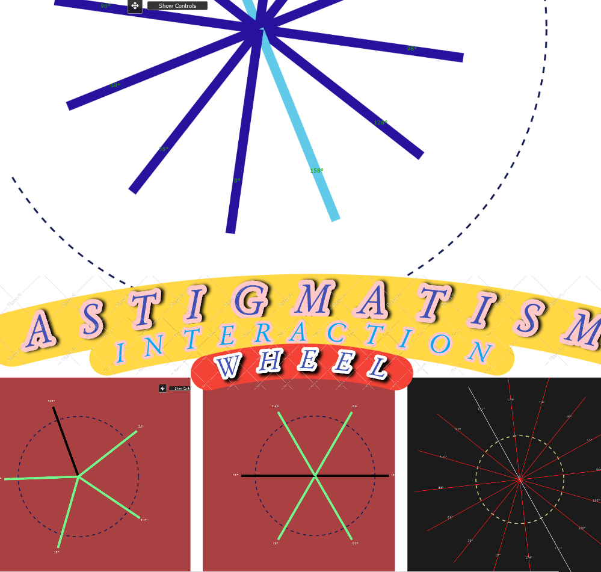

# Astigmatism Wheel Interactions

A dynamic web application visualizing an astigmatism wheel with interactive controls. This project allows users to manipulate various parameters of the visual display, including line thickness, color, opacity, and animation. It also includes an anaglyph 3D mode for viewing with red-cyan glasses.

## Features

*   **Interactive Controls:** A draggable control panel allows for adjusting:
    *   Line thickness and color
    *   Number of radiating lines
    *   Background and text colors
    *   Horizontal and vertical offsets
    *   Arc offset
    *   Line length
    *   Rotation speed
    *   Opacity
    *   Depth offset (for anaglyph 3D mode)
    *   Left and right eye colors (for anaglyph 3D mode)
*   **Visualization Modes:**
    *   **Many Lines:** Displays multiple radiating lines.
    *   **Single Line:**  Shows a single highlighted line.
    *   **Pendulum:**  Simulates a pendulum motion.
    *   **Anaglyph:**  Renders the wheel in 3D for viewing with red-cyan glasses.
*   **Autopilot Modes:** Two autopilot modes with different behaviors for an animated display.
*   **Dark Mode:** Toggle between a light and dark user interface.
*   **Zoom and Pan:**  Use the mouse wheel to zoom and click-and-drag to pan the canvas.  +/- keys can also be used for zooming.
*   **Local Storage Persistence:** Settings are saved in your browser's local storage.
*   **Responsive Canvas:** The canvas resizes to fill the browser window.
*   **Keyboard Controls:**
    *   **a/d:** Rotate the wheel (or pendulum).
    *   **i/k:** Vertical shift.
    *   **j/l:** Horizontal shift.
    *   **u/o:** Arc offset.
    *   **m:** Cycle between visualization modes (Many Lines, Single Line, Pendulum, Anaglyph).
    * **= / +**: Zoom in.
    * **- / _**: Zoom out.

## How to Use

1.  **Open in Browser:** Simply open the `index.html` file in your web browser, or visit the live demo: [https://madalin-fr.github.io/AstigmatismWheelInteraction/](https://madalin-fr.github.io/AstigmatismWheelInteraction/)
2.  **Adjust Controls:** Use the draggable control panel to adjust settings.
    *   Click 'Show Controls' to open or close the settings.
    *   Drag the handle at the top of the controls to move the container.
    *   Click the arrows icon to flip the controls to the other side of the screen.
3.  **Anaglyph 3D:** Select "Anaglyph" from the "Mode" dropdown and use red-cyan glasses to view the 3D effect.  Adjust the "Depth Offset" for optimal viewing.
4.  **Autopilot:** Start either autopilot mode for animated shifts and rotation.
5.  **Dark Mode:** Toggle the dark mode switch (sun/moon icon) at the top of the controls panel.
6.  **Zoom and Pan:** Use the mouse wheel to zoom in/out, and click-and-drag to pan.

## Technical Details

*   **HTML5 Canvas:** The main visual element is rendered using HTML5 `<canvas>`.
*   **JavaScript:** The core logic, interaction, animation, and anaglyph rendering are handled with JavaScript.
*   **InteractJS:** Used for the drag and drop controls.
*   **Font Awesome:** Icons are used to enhance the UI.
*   **Local Storage:** Settings are saved to the local storage and persisted across sessions.
*   **Responsive:** The canvas and layout are responsive to different browser sizes.

## License

This project is licensed under the Creative Commons Attribution-NonCommercial-ShareAlike 4.0 International License.

[http://creativecommons.org/licenses/by-nc-sa/4.0/](http://creativecommons.org/licenses/by-nc-sa/4.0/)

© 2023 Jeremy Bornstein. All Rights Reserved.
© 2024 Frîncu Mădălin-Gabriel. All Rights Reserved.
